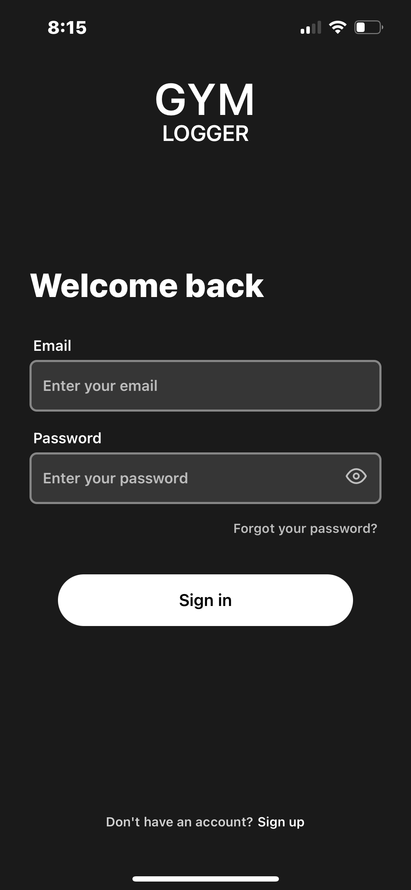
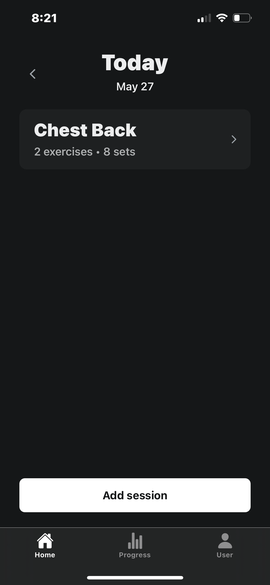
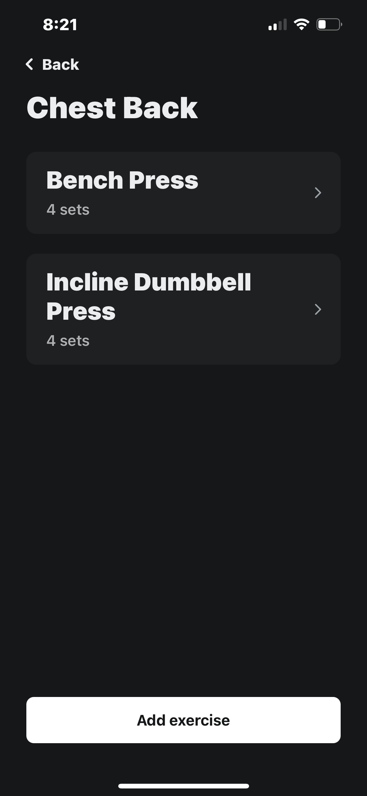
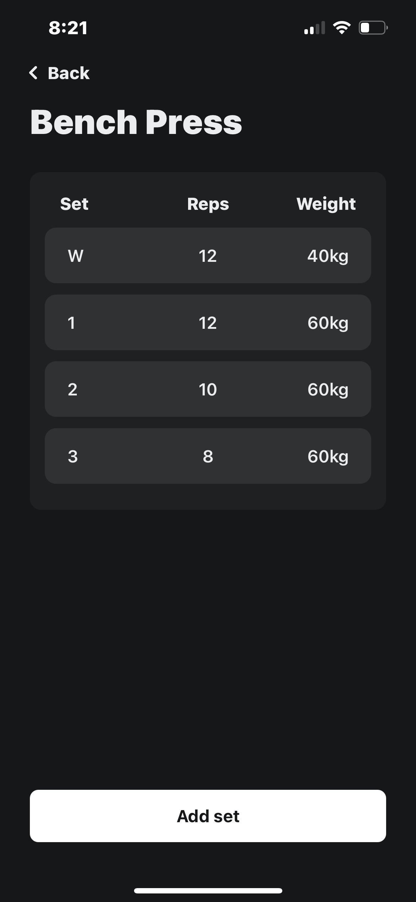
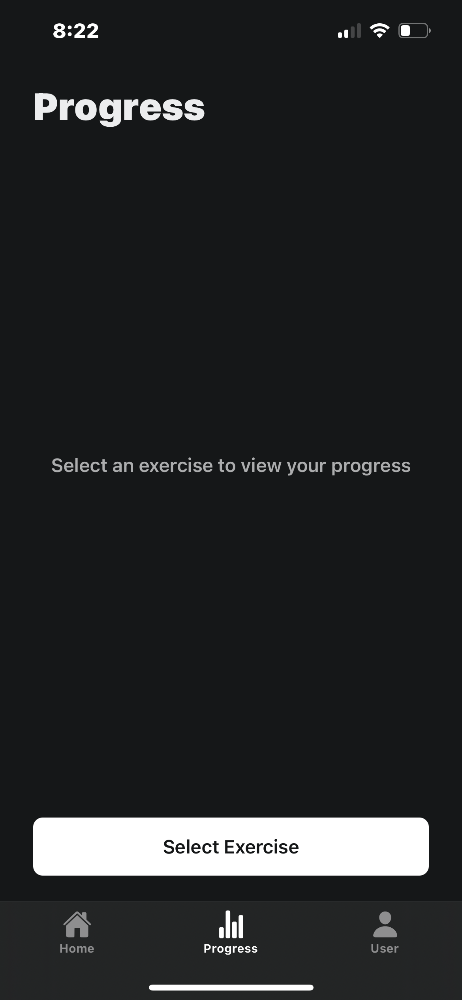
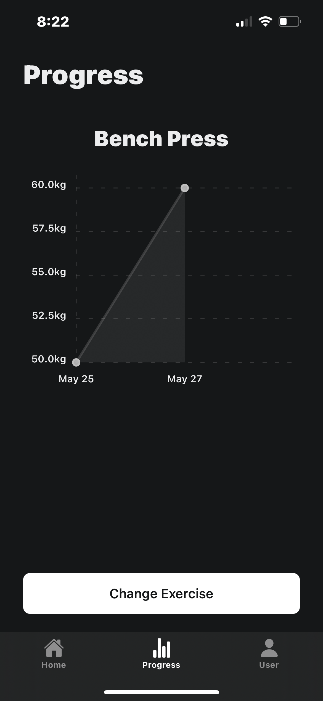
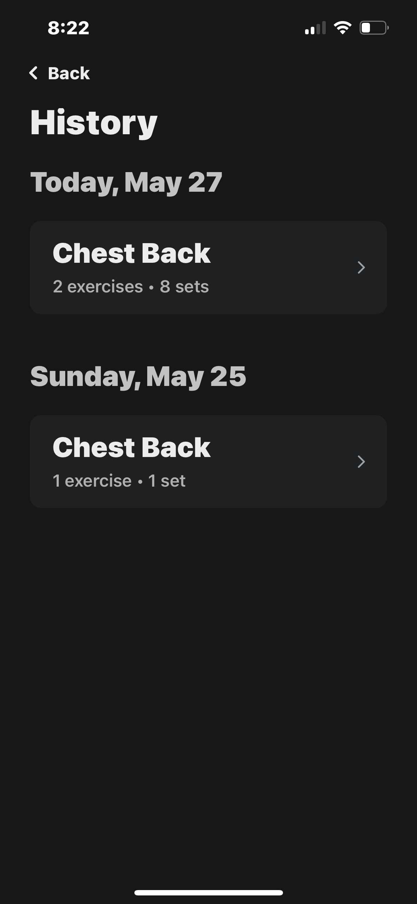

# 💪 Gym Logger App

Track your gym progress, workouts, and personal bests easily with the Gym Logger App.

---

## 📸 Screenshots

### 🔐 Create an account and save your data


### 🏠 Aesthetic, simple home screen


### 🏋️ Track your session, exercises and sets
<div style="display: flex; gap: 10px;">
  
  
</div>

### 📈 Visualize your progress
<div style="display: flex; gap: 10px;">
  
  
</div>

### 📚 All sessions saved in history


---

## 🛠️ Installation & Setup

### 1️⃣ Clone the Repository

```bash
git clone https://github.com/addiiik/GymLoggerApp
cd GymLoggerApp
```

---

### 2️⃣ Start the Client

Open a **new terminal tab** and run:

```bash
cd client
npm install
npx expo start
```

📱 Scan the QR code in the terminal using the **Expo Go app** on your mobile device.

---

### 3️⃣ Start the Server

Open **another terminal tab** and run:

```bash
cd server
docker-compose up
```

💡 Make sure Docker is running on your machine.

---

### 4️⃣ Configure API IP Address

To allow the mobile client to talk to your backend, update the IP address in:

```
client/constants/Api.ts
```

#### 💻 On macOS/Linux:

```bash
ipconfig getifaddr en0
```

#### 🪟 On Windows:

```bash
ipconfig
```

Look for the **IPv4 address** of your local network adapter (usually something like `192.168.x.x`).

---

🔁 Then update this line in `Api.ts`:

```ts
// Before:
export const API_IP = "localhost";

// After (example):
export const API_IP = "192.168.0.101";
```

📱 This step is required for **Expo Go on your phone to access the local server** on your PC.

### 5️⃣ Environment Configuration for Server

The server requires environment variables for the database and JWT authentication.

*Step 1: Create a .env file in the server folder*
Create a .env file inside the server directory with the following content:
```
POSTGRES_USER=gymlogger_postgres
POSTGRES_PASSWORD=password_gymlogger
POSTGRES_DB=gymlogger_db
DATABASE_URL=postgres://gymlogger_postgres:password_gymlogger@db:5432/gymlogger_db
JWT_SECRET=your_secret_jwt_key_here
```

*Step 2: Generate a secure JWT secret*
Generate a strong secret with this command:
```
node -e "console.log(require('crypto').randomBytes(32).toString('hex'))"
```
Copy the output and replace your_secret_jwt_key_here with this value in your .env file.

---

## 🧪 Tech Stack

- **Frontend**: React Native (Expo), TypeScript
- **Backend**: Node.js, Express
- **Database**: Postgres (via Docker)
- **Mobile Runtime**: Expo Go
- **State Management**: Context API
- **Authentication**: JWT

---

## 📄 License

MIT License © [Addiiik](https://github.com/addiiik)
